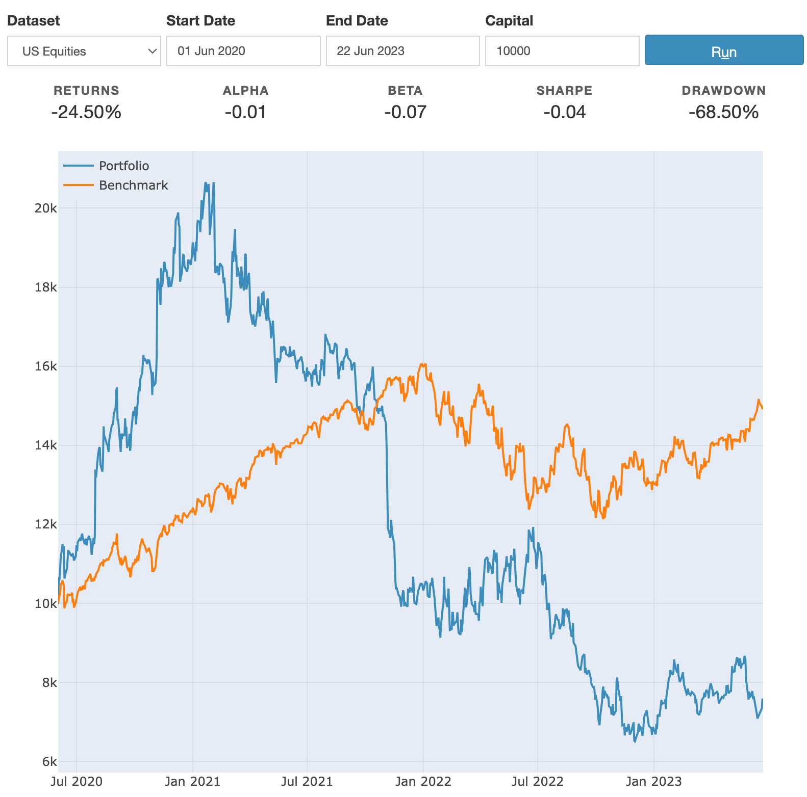

# algo-trading-models-practice
repository for practicing and experimenting with new algorithmic trading models. Sharpen your skills, explore innovative strategies, and contribute to the world of algorithmic trading.

"algo-trading-models-practice" is a GitHub repository dedicated to practicing and exploring new algorithmic trading models. This repository serves as a platform for developers, researchers, and traders interested in experimenting with and developing cutting-edge trading strategies. It provides a collection of code examples, tutorials, and resources to help users implement and backtest their algorithmic trading models using various programming languages and frameworks. Whether you're a beginner or an experienced trader, this repository offers a hands-on environment to refine your skills, test innovative ideas, and contribute to the advancement of algorithmic trading strategies.

## Fundamentals Strats

### Momentum Strats
These strategies profit from the existence of a trend, this could be and uptrend or a downtrend.
Like in physics, momentum in trading is the persistent increase in the price of an asset.

How do you measure momentum?
-   You can measure momentum by measuring the increase or decrease of short-term prices in comparison to long-term prices

An indication of Positive momentum is considering that short-term AVG of an asset price is bigger than long-term avg price

## Evaluation
Sharpe Ratio, which tells us the reutns per unit of risk.
The Sharpe ratio is a measure of risk-adjusted return and is widely used in finance to assess the performance of an investment or trading strategy. It quantifies the excess return generated by an investment compared to a risk-free rate of return per unit of volatility or risk.

The formula for calculating the Sharpe ratio is as follows:

- Sharpe Ratio = (Average Return of the Investment - Risk-Free Rate) / Standard Deviation of the Investment

By calculating the Sharpe ratio, investors can evaluate how well an investment has performed relative to the amount of risk taken. A higher Sharpe ratio indicates a better risk-adjusted return, as it represents a higher return achieved per unit of risk

#### Using Blueshift API
