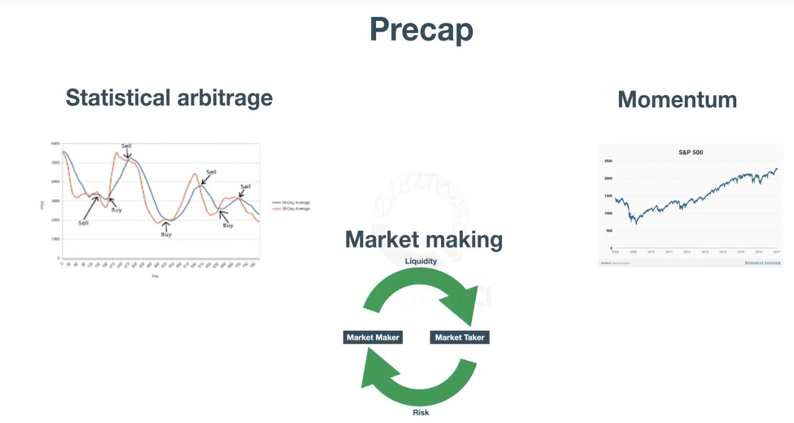

# algo-trading-models-practice
repository for practicing and experimenting with new algorithmic trading models. Sharpen your skills, explore innovative strategies, and contribute to the world of algorithmic trading.

"algo-trading-models-practice" is a GitHub repository dedicated to practicing and exploring new algorithmic trading models. This repository serves as a platform for developers, researchers, and traders interested in experimenting with and developing cutting-edge trading strategies. It provides a collection of code examples, tutorials, and resources to help users implement and backtest their algorithmic trading models using various programming languages and frameworks. Whether you're a beginner or an experienced trader, this repository offers a hands-on environment to refine your skills, test innovative ideas, and contribute to the advancement of algorithmic trading strategies.

## Fundamentals Strats

